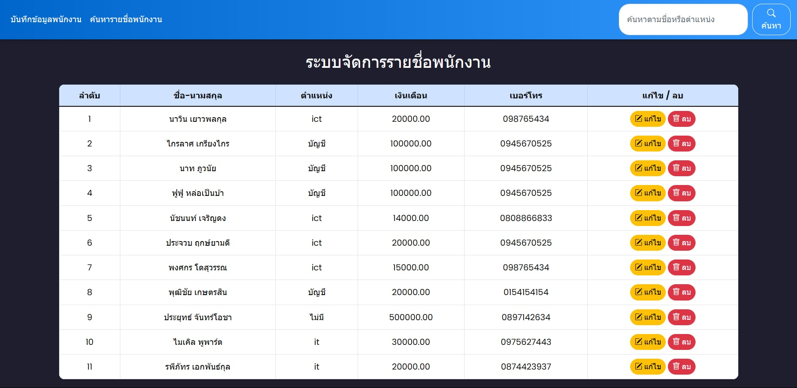
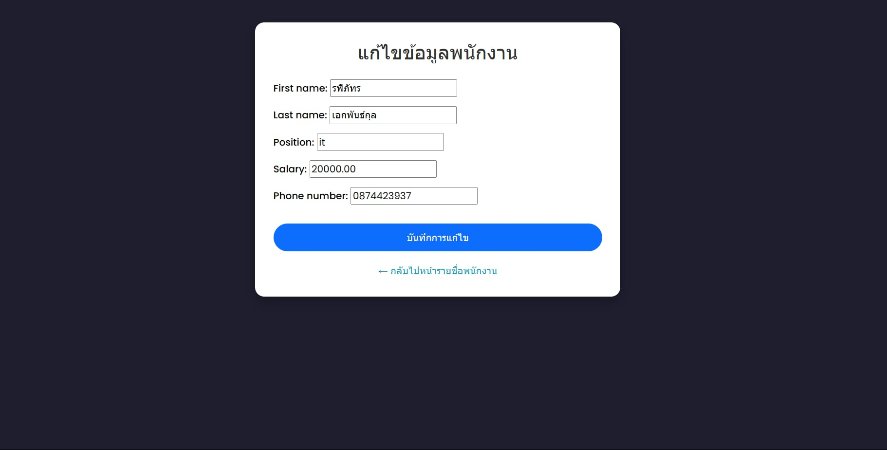
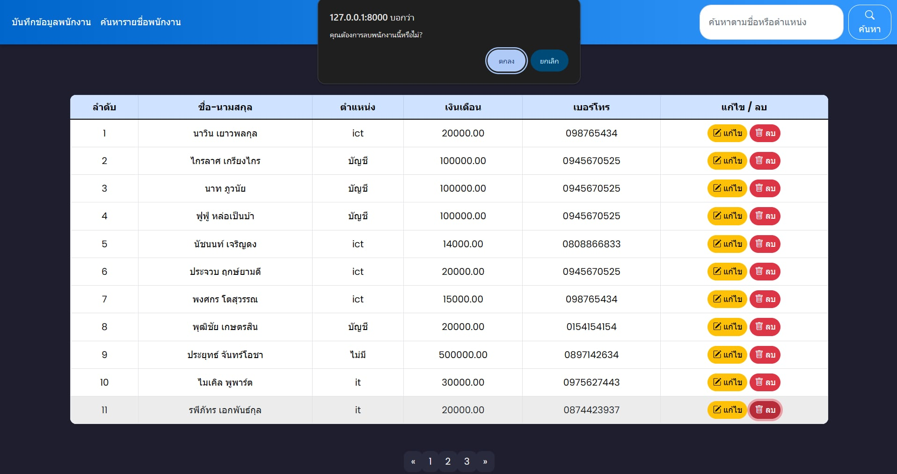
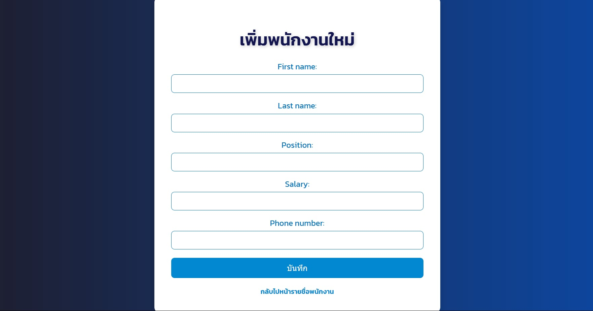
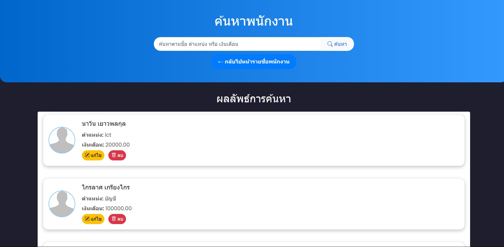

# ระบบจัดการรายชื่อพนักงาน

# หน้าแรกรายชื่อพนักงาน ที่จะมีข้อมูลต่างๆของพนักงาน แลัว สามารถเเก้ไข และ ลบได้

# เมื่อกดเเก้ไขจะถูกย้ายมาหน้านี้ เพื่อแก้ไชข้อมูล แลัวบันทึก

# เมื่อกดปุ่มลบก็จะขึ้นแจ้งเตือนเพื่อยืนยันก่อนลบ

# เมื่อต้องเพิ่มพนักงานใหม่ ให้กดปุ่มทางบนซ้ายของหน้ารายชื่อพนักงานเพื่อมาหน้านี้ จากนั้นเมื่อใส่ข้อมูลครบแลัว จะสารมารถบันทึกได้

# เมื่อต้องการค้นหาพนักงานเพื่อดูข้อมูลหรือแก้ไข ให้กดทางบนซ้ายของหน้ารายชื่อ จากนั้นก็ค้นหาได้เลย

